## Hi, welcome! I'm Vitor 👋

- 🎓🇧🇷 Computer Engineering student at [Universidade Federal do Espirito Santo (UFES)](https://informatica.ufes.br/pt-br/graduacao/engcomp/sobre-o-curso).
- 🎓🇫🇷 Pursuing a Master of Science in Engineering (Diplôme d'Ingénieur) at [IMT Atlantique](https://www.imt-atlantique.fr/en), France.
- 📡 Currently focusing on [Observation and Processing for Environmental data (TAF OPE)](https://moodle.imt-atlantique.fr/course/view.php?id=928)
  - 🌱 Studying sensor systems, wave propagation, signal & image processing, data processing, and applied Machine Learning.
  - 🛰️ Exploring radar, LiDAR, sonar, remote sensing, 2D/3D imaging, embedded sensors, and robotics.

  
  

 
  
  
  
  
   
  
  
  
 

##

 
  
  
 
  
 

